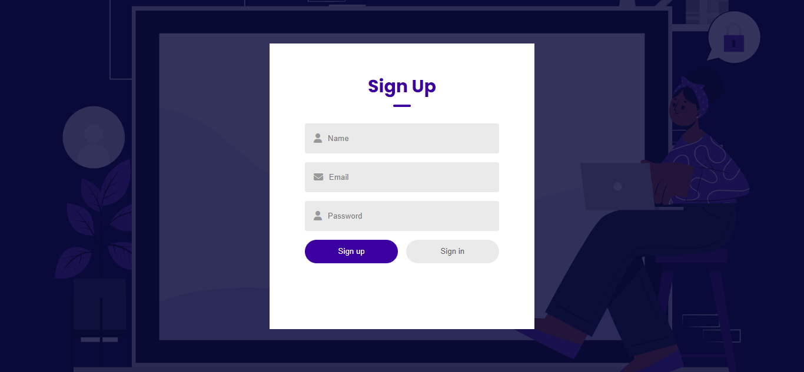
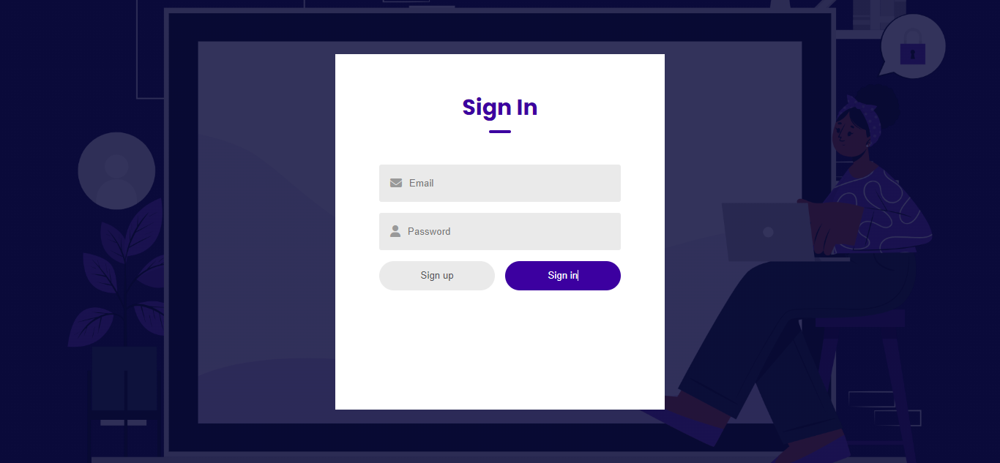
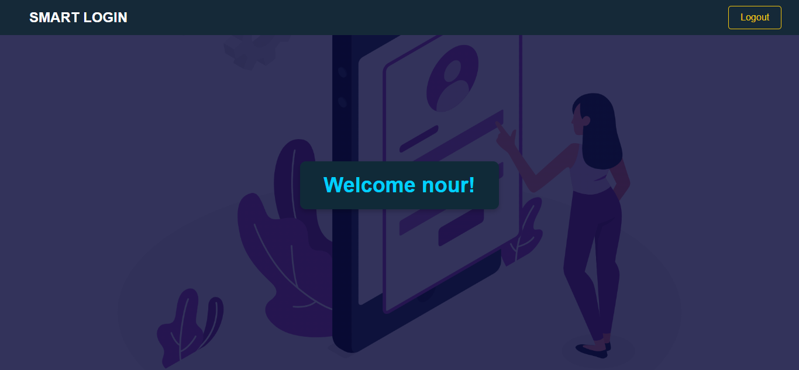

# Login System






## Overview
The **Login System** is a simple web project aimed at providing a user interface for login and registration. This project uses HTML, CSS, and JavaScript to create a seamless and efficient user experience.
## Features
- **User Registration**: Allows new users to create an account.
- **Login Interface**: Simple and easy-to-use login interface.
- **Input Validation**: Ensures the validity of the data entered by users.
-  **Data Storage:** Utilizes Local Storage to persist data across sessions, ensuring that user data  are saved even after the browser is closed.
-  **User-Friendly Interface:** Clean and intuitive design for easy navigation and usage.
-  **Responsive Design:** The application adapts to different screen sizes and devices, ensuring a user-friendly experience on desktops, tablets, and mobile phones.
  
## Demo
You can view the live demo of the application [here](https://nourkuktut.github.io/loginSystem/).

## Installation

To run the project locally, follow these steps:

### Prerequisites
- Any modern web browser.

### Steps

1. Clone the repository:
   ```bash
   git clone https://github.com/your-username/your-repo-name.git
2. Navigate to the project directory:
   ```bash
         cd loginSystem
3. Open the index.html file in your browser or run a live server for development:
     ```bash
           open index.html
 ## Technologies
- HTML5: For the structure of the web pages.
- CSS3: For styling and layout.
- JavaScript{ES6}:Handles input validation. It ensures that the user-provided data meets certain criteria before the form is submitted.
- Local Storage: To persist data across sessions, allowing users to save their data user even after closing the browser.

## Contributing
If you would like to contribute to this project, feel free to fork the repository and submit a pull request. Here’s how you can contribute:
1. Fork this repository.
2. Create a new branch (git checkout -b feature/your-feature-name).
3. Make your changes and commit them (git commit -m 'Add your-feature-name').
4. Push to the branch (git push origin feature/your-feature-name).
5. Open a Pull Request.

### License:
- This project is licensed under the MIT License.
## Contact:
For inquiries about this project or similar development services, feel free to contact me:
<br>
**Linkedin: [here](https://www.linkedin.com/in/nourkutkut).**
<br>
**Email:nourkutkut12@gmail.com**
